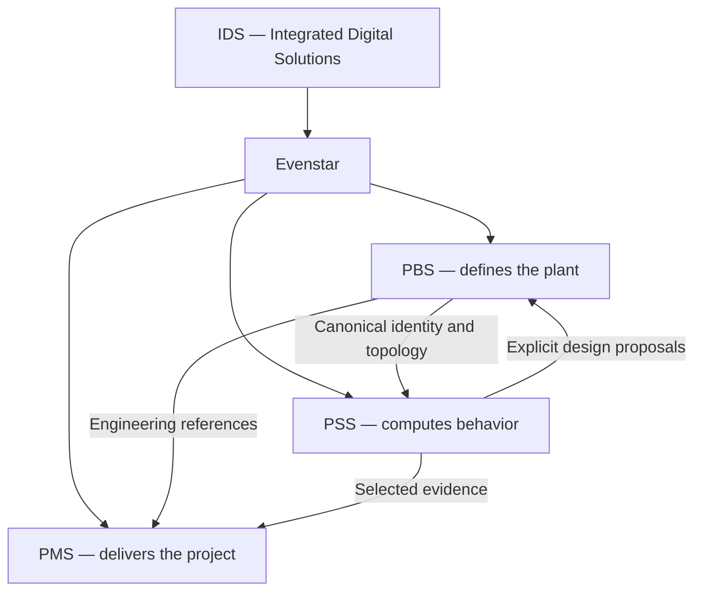

# Evenstar

**Define the plant once. Reuse its knowledge to calculate behavior and deliver controlled engineering work.** Evenstar is an IDS engineering initiative.

**Governing principles:** one engineering object, many representations; create once and reuse; start from Project; the project knows what it already knows; one explicit authoritative owner per datum.

**Current development state:** knowledge base initialized; product implementation is unverified from the supplied evidence. **Current priority:** review this project brain, then resolve the shared object/topology/ownership/revision contract for a narrow proof. Product implementation awaits your review.

## Explore

- [[IDS_CONTEXT|IDS context]]
- [[EVENSTAR_VISION|Vision]]
- [[EVENSTAR_PRINCIPLES|Governing principles]]
- [[SYSTEM_MAP|System map]]
- [[PBS_HOME|PBS — What are we building?]]
- [[PSS_HOME|PSS — How does it behave?]]
- [[PMS_HOME|PMS — How are we delivering it?]]
- [[ARCHITECTURE_INDEX|Architecture and boundaries]]
- [[DATA_OWNERSHIP|Who owns each datum?]]
- [[SHARED_MODEL_INDEX|Shared engineering concepts]]
- [[WORKFLOWS_INDEX|Engineering and delivery workflows]]
- [[REQUIREMENTS_INDEX|Stable requirement registers]]
- [[ADR_INDEX|Current and historical decisions]]
- [[CURRENT_STATE|Evidence-backed current state]]
- [[ROADMAP|Proposed roadmap]]
- [[BACKLOG|Possible work]]
- [[OPEN_QUESTIONS|Open questions]]
- [[CONFLICT_REGISTER|Conflicts and ambiguities]]
- [[DEMO_STRATEGY|Demonstration strategy]]
- [[FUTURE_IDEAS|Future ideas]]
- [[SOURCE_INDEX|Preserved source corpus and traceability]]
- [[GLOSSARY|Glossary]]
- [[KNOWLEDGE_GOVERNANCE|How this project memory is maintained]]
- [[INITIALIZATION_REPORT|Initialization report]]
- [[CONSISTENCY_REVIEW|Consistency review]]

## Source

- [[INITIALIZATION_MANDATE]]
