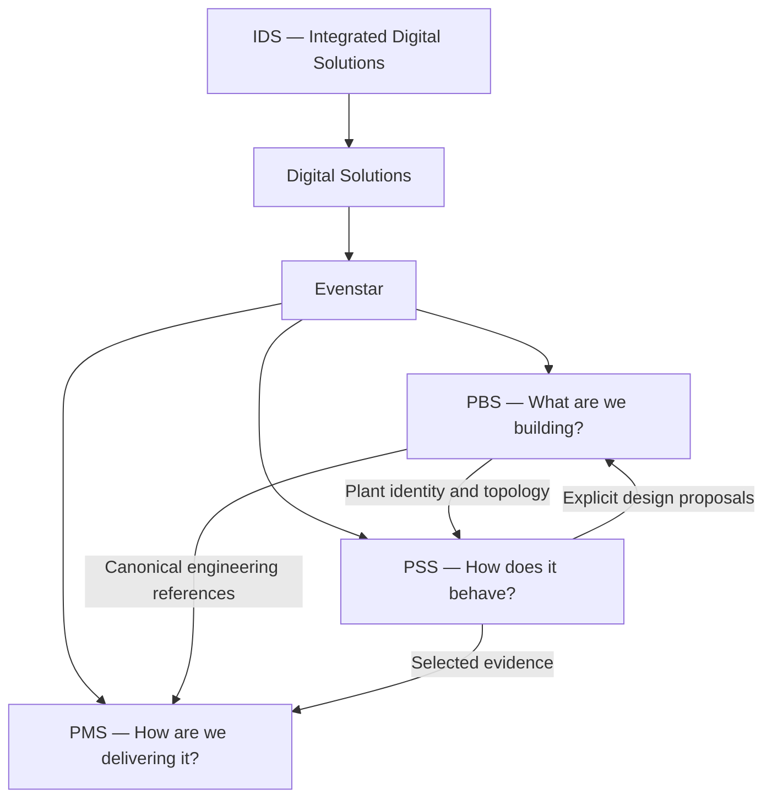

# Evenstar system map

Supabase/PostgreSQL is the initial canonical PBS and shared-identity data direction. PSS and PMS have separate collaboration domains and Airtable bases. Shared identity connects the systems; physical co-location of all data is not required.

North Star is a separate open-source project outside Evenstar, with any future integration through adapters.

## Related notes

- [[PBS_HOME]]
- [[PSS_HOME]]
- [[PMS_HOME]]
- [[INTEGRATION_ARCHITECTURE]]
- [[NORTH_STAR_BOUNDARY]]

## Source

- [[99_SOURCES/EVENSTAR_PBS_ASTRA#1. Position Inside Evenstar|PBS — 1. Position Inside Evenstar]]
- [[99_SOURCES/EVENSTAR_PBS_ASTRA#16. Supabase / PostgreSQL|PBS — 16. Supabase / PostgreSQL]]
- [[99_SOURCES/EVENSTAR_PBS_ASTRA#21. Project Creation|PBS — 21. Project Creation]]
- [[99_SOURCES/EVENSTAR_PBS_ASTRA#22. Relationship to PSS|PBS — 22. Relationship to PSS]]
- [[99_SOURCES/EVENSTAR_PBS_ASTRA#23. Relationship to PMS|PBS — 23. Relationship to PMS]]
- [[99_SOURCES/EVENSTAR_PBS_ASTRA#24. Relationship to North Star|PBS — 24. Relationship to North Star]]
- [[99_SOURCES/EVENSTAR_PSS_ASTRA#2. Relationship to Evenstar|PSS — 2. Relationship to Evenstar]]
- [[99_SOURCES/EVENSTAR_PSS_ASTRA#16. Integration Architecture|PSS — 16. Integration Architecture]]
- [[99_SOURCES/EVENSTAR_PMS_AIRTABLE_ASTRA#15. Data Flow|PMS — 15. Data Flow]]
- [[99_SOURCES/EVENSTAR_PMS_AIRTABLE_ASTRA#16. PSS Base vs PMS Base|PMS — 16. PSS Base vs PMS Base]]
