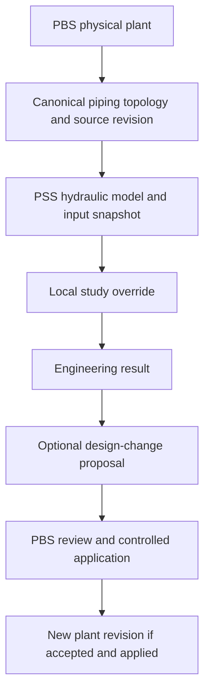

# PBS to PSS hydraulics

**Trigger:** Engineer needs a hydraulic study of an existing PBS physical plant.

## Architecture in one flow

## Flow

1. Select a PBS plant/network and source revision.
2. Extract canonical piping topology, stable ports/nodes, physical lengths/diameters/elevations, fittings/valves and equipment where available.
3. Validate completeness and units, map to the PSS hydraulic model and preserve the source snapshot.
4. Add simulation-only fluid/boundary/method/roughness/curve assumptions and optional study overrides.
5. Calculate and inspect engineering results; publish meaningful ordered nodes to the PSS register.
6. Optionally create a design-change proposal with affected PBS UUIDs and supporting run evidence.
7. PBS reviews/applies or rejects the proposal through the controlled change path.

## Ownership and exceptions

PBS owns physical plant/topology. PSS owns model, assumptions, overrides and results. A study diameter does not alter PBS. Missing data should be surfaced; exact completeness gates and extraction schema await OQ-006.

## Intended completion evidence

Known topology was reused without redrawing; the run resolves its PBS revision; old evidence is stable; any plant change follows explicit review/application.

## Related notes

- [[WORKFLOWS_INDEX]]
- [[PBS_PIPING]]
- [[PSS_HYDRAULICS]]
- [[PSS_TO_PBS_DESIGN_CHANGE]]
- [[OQ-006]]

## Source

- [[99_SOURCES/EVENSTAR_PBS_ASTRA#13. PBS → PSS Hydraulics|PBS — 13. PBS → PSS Hydraulics]]
- [[99_SOURCES/EVENSTAR_PBS_ASTRA#19. Cross-System Change Principle|PBS — 19. Cross-System Change Principle]]
- [[99_SOURCES/EVENSTAR_PBS_ASTRA#26. Revisions and Engineering Change|PBS — 26. Revisions and Engineering Change]]
- [[99_SOURCES/EVENSTAR_PSS_ASTRA#4. Major PSS Workspaces|PSS — 4. Major PSS Workspaces]]
- [[99_SOURCES/EVENSTAR_PSS_ASTRA#12. Results Publication Philosophy|PSS — 12. Results Publication Philosophy]]
- [[99_SOURCES/EVENSTAR_PSS_ASTRA#15. Study Overrides and Design Proposals|PSS — 15. Study Overrides and Design Proposals]]
- [[99_SOURCES/EVENSTAR_PSS_ASTRA#22. MVP Vertical Slice|PSS — 22. MVP Vertical Slice]]

## Related requirements

- [[INT-REQ-004]]
